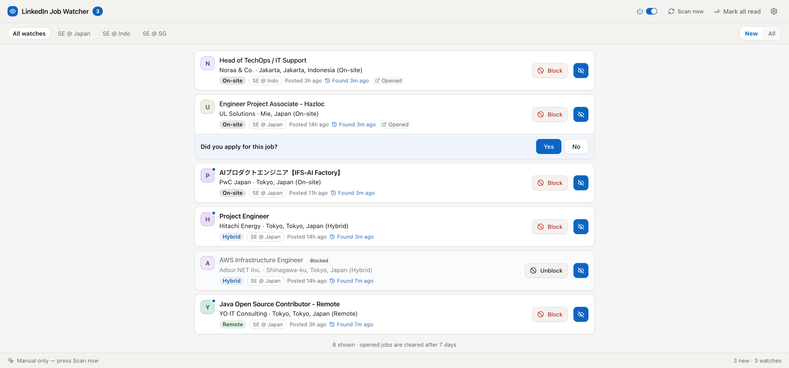
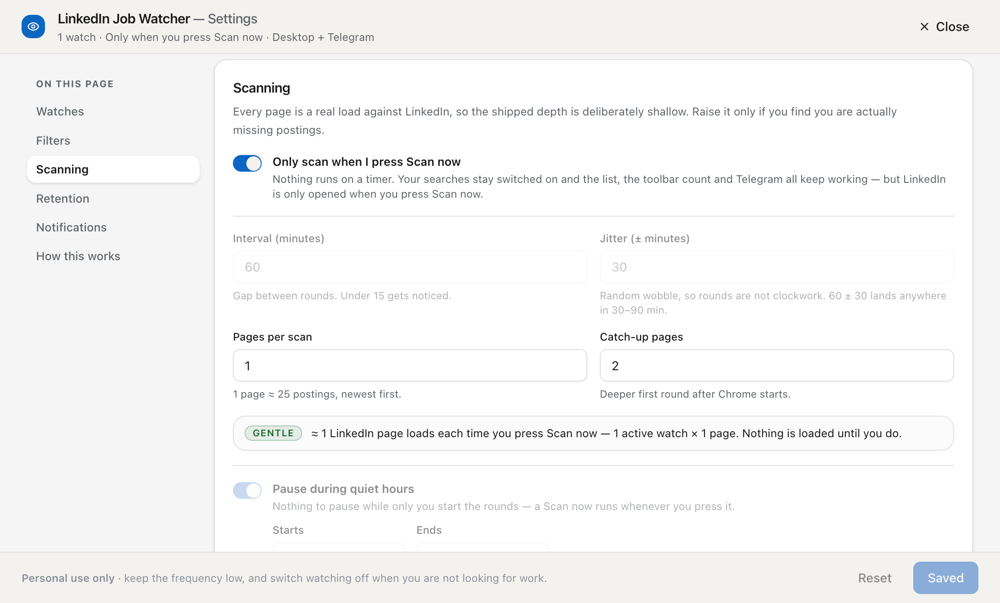

# LinkedIn Job Watcher

A personal Chrome extension that watches your saved LinkedIn job searches in the
background and tells you about **genuinely new** postings — a count on the
toolbar icon, one desktop notification per round, and optionally a Telegram
message on your phone.

It reads the pages while you are logged in, in your own browser, in a small
window that opens for a few seconds and closes itself. Notifications lead into
the extension's **own** list, never straight to LinkedIn — you decide what to
open from there.



> **Heads up:** reading LinkedIn's pages with a script is against their Terms of
> Service. Personal single-user use in your own logged-in browser is low-risk in
> practice, but the risk is not zero — a restricted account is the realistic
> worst case, and it would be **your** account. Keep the scan depth low; the
> shipped defaults already are. See [LICENSE.md](LICENSE.md).

---

## Requirements

| Software     | Requirement                                              |
| ------------ | -------------------------------------------------------- |
| **Node.js**  | `v24.18.0` — see [.nvmrc](.nvmrc). Needed once, to build |
| **Chrome**   | Any current Chrome or Chromium                           |
| **LinkedIn** | You must be **signed in** in the same Chrome profile     |

---

## Install (5 minutes)

### 1. Build it

```bash
nvm use        # optional, picks up .nvmrc
npm install
npm run build
```

That produces a loadable extension in `dist/`. **No configuration file is
needed** — not to build it, not to run it, not to get notifications.

### 2. Load it into Chrome

1. Open `chrome://extensions`
2. Turn on **Developer mode** (top-right)
3. Click **Load unpacked**
4. Select the **`dist/`** folder — not the repository root

Pin the extension to your toolbar so you can see the count.

> Always load `dist/`. The [extension/](extension/) folder is an old experiment,
> not the product, and is deliberately left out of the build.

### 3. Add your first search

1. On LinkedIn, run a job search with all your filters applied.
2. **Sort by "Most recent"** — this matters. The defaults read only page 1, which
   assumes newest-first ordering.
3. Copy the whole URL from the address bar.
4. Right-click the extension icon → **Options** (or click the gear in the popup).
5. Under **Watches**, click **Add a watch**, give it a nickname (e.g. "SE @
   Japan") and paste the URL → **Add watch**.
6. Click **Save settings** at the bottom. _Nothing is stored until you save._

Any URL that works in your browser works here — your keywords and filters are
kept exactly as they are. The first round runs on the next scheduled tick, or
straight away if you open the popup and press **Scan now**.

---

## Daily use

**The number on the toolbar icon** is how many jobs you have not dealt with yet.
Opening a job takes it off the count; the card stays in the list until you mark
it read.

| Icon        | Meaning                                                                          |
| ----------- | -------------------------------------------------------------------------------- |
| Grey number | Jobs you have not looked at (`99+` past 99)                                      |
| Amber       | Something is off — LinkedIn's layout may have changed, or rounds have gone stale |
| Red `!`     | Stopped — you are signed out of LinkedIn, or LinkedIn asked for verification     |

**Click the icon** for the popup (a 380px panel, opens on **New**).
**Click a notification** for the same list as a full tab (an 880px column, opens
on **All**). An already-open tab is reused rather than duplicated.

### What you can do with a job

- **Click it** → opens the posting in a new tab. The card stays in the list, so
  nothing disappears because you looked at it. Cmd/Ctrl/middle-click opens it in
  the background.
- **The eye button** marks that one job read: the card greys out, drops out of
  **New**, and the count falls by one. This is the only thing that clears a job.
  Press it again to bring the job back.
- **Block** adds that job's company to your blocklist without a trip to Options.
  Future rounds stop surfacing it. Jobs already in your list stay on screen,
  greyed and tagged **Blocked**, and stop counting. It asks first — the button
  reads **Sure?** after one press and only blocks on the second. Click anywhere
  else, or wait five seconds, and the question goes away. It then reads
  **Unblock**, which takes a single press.

### "Did you apply for this job?"

Opening a posting queues that question on the job's own card, so you find it
waiting when you come back from LinkedIn.

- **No** records nothing and closes it. You might apply tomorrow, and a stored
  "no" would go stale. Marking the job read counts as No too.
- **Yes** opens a note box with quick-note chips ("Referral", "Recruiter"…).
  **Cmd/Ctrl + Enter** saves, **Esc** cancels. Cancelling takes the Yes back with
  it — nothing is recorded and nothing is sent.
- Saving tags the card **Applied** and, if Telegram is on, pushes an `[Applied]`
  message with your note. The question is never asked about that job again.
- Tapping the **Applied** tag undoes it. That does throw the note away, which is
  the price of a one-tap undo.

### The rest of the list

- **The on/off switch** in the header pauses the whole extension. Nothing is
  scanned — not even by **Scan now** — until you turn it back on.
- **Scan now** runs a round immediately, ignoring the interval and quiet hours.
  It says _Scanning…_ from the moment you press it, not when the background gets
  round to answering. The list repaints itself when the round finishes, and the
  next automatic round is a full interval away rather than stacked minutes
  behind. When LinkedIn has asked for verification the same button turns red and
  reads **Resume** — that is how you clear the halt.
- **The status bar** along the bottom says what the loop is doing: _Scanning for
  new jobs…_ while a round runs, otherwise a live countdown (_Next scan in 4m
  12s_). It reads the real armed alarm, so it cannot drift from the actual
  schedule. Inside quiet hours it says so. Under manual-only it reads _Manual
  only — press Scan now_, and when the extension is switched off, _Paused_.
- **Watch chips** filter the list to one search; the count still covers all of
  them. **New ⇄ All** switches between unread-only and everything. **Mark all as
  read** clears both at once.
- **Open as a full page** (in the popup) moves the list you are looking at into a
  tab, keeping your chip and mode. The popup closes the instant you click
  anything outside it, which is the wrong place to read a long list. In the popup
  the other controls fold into a menu button; the tab has room to show them all.
- Your last chip and mode are remembered, so reopening lands you where you left
  off.

A card therefore has three looks: white with a dot (untouched), plain (you opened
it), and greyed (you read it, or blocked its company).

---

## Settings



The header and the save bar stay put while the sections between them scroll. The
rail on the left jumps to any section and marks the ones holding unsaved edits.
The line under the title summarises the whole configuration — how many watches,
how often, when they stop, where a find is delivered — and it tracks what you are
_about_ to save, not what you saved last.

### Watches

Add, edit, remove and individually pause saved searches. Enabled watches all run
on the same round, strictly one after another — never at the same time. Each row
reads its own URL back as chips (keywords, place, date posted, job type,
remote/hybrid/on-site), so two saved searches are tellable apart without reading
200 characters of URL.

### Filters

- **Blocked companies** — matched loosely and case-insensitively, so "acme"
  catches both "Acme Corp" and "PT Acme Indonesia". The **Block** button on any
  card adds and removes entries here too.
- **Blocked title keywords** — e.g. "Intern", "Senior".
- **Hide reposted** — drop anything LinkedIn marks as "Reposted". Applied on
  every render, so switching it off brings those rows straight back.

Filtered jobs are still recorded as seen, so they never resurface later.

### Scanning

| Setting                         | Default       | What it does                                                                                                          |
| ------------------------------- | ------------- | --------------------------------------------------------------------------------------------------------------------- |
| Only scan when I press Scan now | off           | No automatic rounds at all — see below                                                                                |
| Interval                        | `60` min      | Base time between rounds                                                                                              |
| Jitter                          | `± 30` min    | Randomised onto each interval, so every round lands somewhere in 30–90 minutes and there is no clockwork to recognise |
| Pages per scan                  | `1`           | Routine depth. One page is about 25 postings, newest first                                                            |
| Catch-up pages                  | `4`           | A deeper first round after Chrome restarts, or when quiet hours end                                                   |
| Quiet hours                     | `23:00–07:00` | Scanning pauses overnight; resuming triggers one catch-up round                                                       |

**Only scan when I press Scan now.** Switch this on and no round ever runs by
itself — nothing is loaded from LinkedIn until you press **Scan now**. Everything
else carries on as normal: your searches stay on, and a manual round updates the
list, the count, the notification and Telegram exactly as a scheduled one would.
It is _not_ the same as the header's on/off switch, which pauses the whole
extension including the button; this one just hands the timing to you. Your
interval, jitter and quiet hours are kept as you set them, greyed out while it is
on, and go straight back into service when you switch it off.

The section shows what those numbers add up to: an estimate of the LinkedIn page
loads a day they cause, tiered **Gentle / Heavy / Risky**, with the arithmetic
spelled out. It is deliberately a ceiling — it ignores the back-off and assumes
Chrome is open all day. Raise the depth only if you find you are actually missing
postings.

There is also automatic back-off: after three rounds in a row that find nothing
at all, the interval stretches out towards a 240-minute ceiling. One round that
finds something resets it.

### Retention

How long records are kept: seen IDs `15` days, jobs you have opened or read `7`
days, untouched jobs `30` days, with a hard cap of `50,000` seen IDs. **Not yet
enforced** — see [Known limitations](#known-limitations).

### Notifications

- **Desktop notification** — the pop-up announcing a round that found something.
  One per round, never one per job. Switching it off silences the pop-up only:
  the toolbar count still moves and Telegram still delivers.
- **Also push to Telegram** — optional, and _additive_ to the desktop
  notification rather than a replacement. See below.

### How this works

The last section: what a round actually does, in plain English, plus the things
worth knowing before you trust a background scraper.

> **Save settings** writes your changes. **Reset** reverts the form to the
> last-saved values — it is not a factory reset. It asks before discarding, and
> is greyed out when there is nothing unsaved to discard.

---

## Telegram push (optional)

Get new jobs on your phone.

1. **Create a bot** — message [@BotFather](https://t.me/BotFather) on Telegram,
   send `/newbot`, follow the prompts. It hands you a token like `123456:ABC-DEF…`.
2. **Get your chat id** — message your new bot once (say anything), then open:

   ```text
   https://api.telegram.org/bot<YOUR_TOKEN>/getUpdates
   ```

   Read `result[0].message.chat.id` out of the JSON.

3. In **Options → Notifications**, switch on **Also push to Telegram**, paste
   both values, and click **Send test message**. Success or failure is reported
   on the spot. It sends whatever is in the fields right now, so you can prove a
   token before switching the pushes on.
4. **Check it on your phone**, not just desktop Telegram — confirm the links are
   tappable and the layout reads well.
5. Click **Save settings**.

Your credentials live only in this browser's extension storage. They are never
committed and never sent anywhere but Telegram.

A batch of more than 10 jobs arrives as several messages, numbered straight
through, rather than being cut short. A push that fails can never break a round —
after three failures in a row you get a soft warning suggesting you re-run **Send
test message**.

---

## Troubleshooting

**The icon shows a red `!`**
Open the popup — a one-line banner says which it is:

- _"Signed out of LinkedIn — scanning paused."_ Sign back in; scanning resumes on
  its own at the next round.
- _"LinkedIn asked for verification — scanning stopped."_ Open LinkedIn and clear
  the challenge, then press **Resume** in the popup. Nothing else clears this,
  because a stopped extension never runs the successful round that would clear it
  by itself. If the challenge is still there, the next round simply stops again.

**The icon is amber**
Either the page reader found no results list at all — LinkedIn may have changed
its layout — or rounds have gone stale.

**Nothing ever gets scanned**
Press **Scan now** first. It skips the interval and quiet hours, so it tells you
straight away whether the problem is the schedule or the scanning. If that finds
nothing either, check in order: at least one watch is **enabled**; the header's
on/off switch is on; you are signed in to LinkedIn in this profile.

Note the default quiet hours are **23:00–07:00**, so an extension installed late
at night genuinely will not scan until morning. That is the schedule working, not
a fault. Likewise, with **Only scan when I press Scan now** switched on there is
no schedule at all — that is the setting doing exactly what it says.

**Watching a round happen**
`chrome://extensions` → **service worker** under this extension opens the
background console. Everything a round does is logged there.

**`npm run build` fails with `Cannot find module '@rollup/rollup-darwin-arm64'`**
A known npm bug with optional platform packages:

```bash
rm -rf node_modules package-lock.json && npm install
# or, without touching the lockfile:
npm install @rollup/rollup-darwin-arm64 --no-save
```

**After pulling new code:** re-run `npm run build`, then press **Reload** (⟳) on
the extension card in `chrome://extensions`.

---

## Known limitations

Real gaps in the current build, not misconfiguration:

1. **Retention is not enforced yet.** The pruning logic exists and is tested, but
   nothing runs it on a schedule. The Retention settings are saved and currently
   have no effect, so stored records grow without bound. Nothing will break
   because of it any time soon.
2. **Nothing runs while Chrome is closed.** Not a bug, and not fixable — browser
   extensions have no background process of their own. One deeper catch-up round
   runs when Chrome starts again.

---

## More

| Document                                     | Description                                                                                     |
| -------------------------------------------- | ----------------------------------------------------------------------------------------------- |
| [docs/how-it-works.md](docs/how-it-works.md) | What a round actually does, why the scan window is visible, what each permission is for         |
| [CONTRIBUTING.md](CONTRIBUTING.md)           | Building, testing, and the rules the code follows                                               |
| [prd.md](prd.md)                             | The full specification, and the argument behind every decision                                  |
| [LICENSE.md](LICENSE.md)                     | **Personal use only.** Free to use, change and share — never to publish as an extension or sell |
